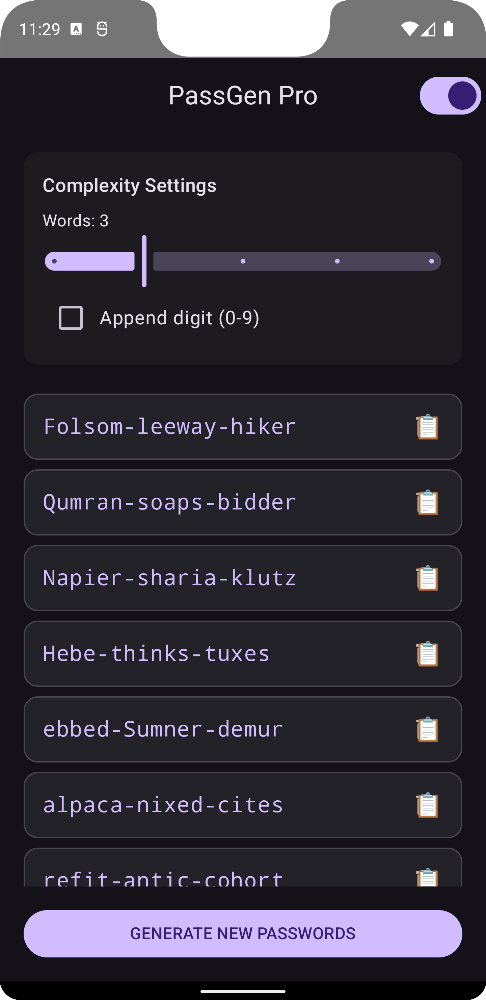

# An Android APK to generate possible passwords

This is a very simple app that uses the subset of words from Linux file /usr/share/dict/words that are between 4 and 6 characters long and consist of alphabetical characters.

It uses these words to generate combinations of the words randomly that could be memorable.

I was motivated as I was running out imagination for this form of password content. I noticed that in one place that I had worked, that the password to an important resource was actually the What 3 Words of the business location.

The app shows a list of possible passwords and you can pick one and copy it to your clipboard for use and adding to your password manager.

This is an AndroidStudio Project, so you should probably use it to edit the code.